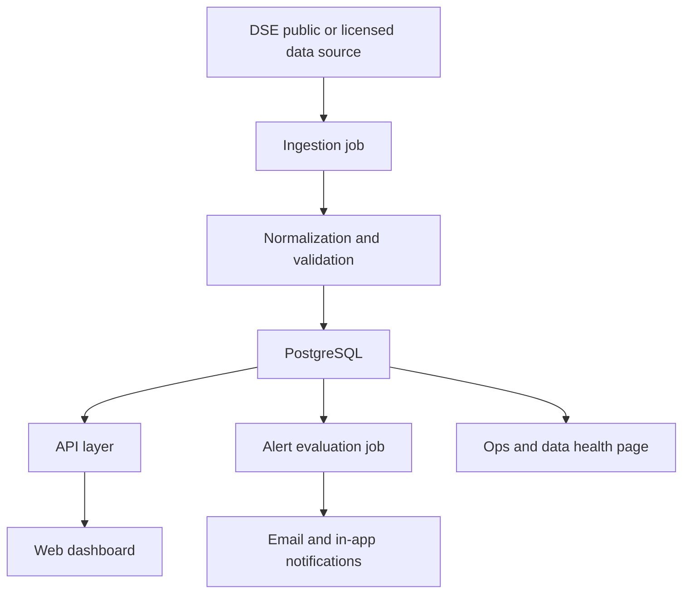

# Technical Architecture

## Project
Tanzania DSE Investor Dashboard

## Date
March 11, 2026

## Objective
Define a practical MVP architecture for a web dashboard that tracks price rises and drops for selected Dar es Salaam Stock Exchange securities using daily or delayed market data.

## Architecture Goals
- Support reliable end-of-day market monitoring.
- Make data freshness visible and auditable.
- Keep the system simple enough for fast MVP delivery.
- Preserve a clean upgrade path from public-source ingestion to licensed market data.
- Support personal watchlists and alerts without overengineering.

## Recommended Stack
### Frontend
- Next.js web application
- TypeScript
- Tailwind CSS or a simple component system
- Lightweight charting library such as Recharts or Apache ECharts

### Backend
- Next.js API routes for MVP or a small Node.js service layer
- TypeScript
- Background ingestion worker running on a schedule

### Data Layer
- PostgreSQL
- Prisma ORM
- Redis optional for future alert queueing and caching, not required in first cut

### Infrastructure
- Vercel or similar for frontend and API hosting
- Managed PostgreSQL such as Neon, Supabase Postgres, or Railway Postgres
- Cron-based scheduled job for daily ingestion
- Email provider such as Resend, Postmark, or SendGrid for alerts

## High-Level System Components
1. Web client
2. Application API
3. Authentication module
4. Market data ingestion job
5. Alert evaluation job
6. Relational database
7. Notification service
8. Admin ops page for ingestion health

## Architecture Diagram

## Core User Flows
### 1. Market Refresh
1. Scheduler starts ingestion job after DSE publishes daily data.
2. Job fetches source documents or tables.
3. Parser extracts securities and price fields.
4. Validator checks schema, missing values, and duplicates.
5. Normalizer writes security master updates and price snapshots.
6. Job records source URL, ingestion timestamp, and run status.
7. Alert evaluator runs against updated price snapshots.

### 2. Dashboard Usage
1. User signs in.
2. User loads dashboard.
3. Frontend requests top movers, watchlist rows, and freshness metadata.
4. User opens a security detail view.
5. Frontend requests historical daily prices and metadata.
6. User creates an alert.

## Data Source Strategy
### MVP Source Mode
- Use public DSE web pages, reports, or downloadable market summaries as the source of truth for daily price monitoring.
- Persist raw ingestion metadata so parsing can be audited.

### Future Source Mode
- Replace source adapter with an official or licensed feed if DSE data licensing is secured.
- Keep downstream schema unchanged so application features continue to work.

## Data Model
### security
- id
- ticker
- company_name
- sector
- listing_type
- listing_date
- is_active
- created_at
- updated_at

### price_snapshot
- id
- security_id
- market_date
- currency
- open_price nullable
- high_price nullable
- low_price nullable
- last_price
- previous_close nullable
- absolute_change nullable
- percent_change nullable
- volume nullable
- source_name
- source_reference nullable
- ingested_at
- unique constraint on security_id and market_date

### watchlist
- id
- user_id
- name
- created_at
- updated_at

### watchlist_item
- id
- watchlist_id
- security_id
- created_at
- unique constraint on watchlist_id and security_id

### alert
- id
- user_id
- security_id
- type
- threshold_value
- direction nullable
- channel
- is_active
- last_triggered_at nullable
- created_at
- updated_at

### notification
- id
- user_id
- alert_id nullable
- security_id nullable
- title
- body
- channel
- status
- sent_at nullable
- created_at

### ingestion_run
- id
- source_name
- market_date
- status
- records_seen
- records_inserted
- records_updated
- records_failed
- started_at
- completed_at nullable
- error_summary nullable

## API Surface
### Public or Authenticated Endpoints
- `GET /api/market/overview`
- `GET /api/securities`
- `GET /api/securities/:ticker`
- `GET /api/securities/:ticker/history?range=30d`
- `GET /api/watchlists`
- `POST /api/watchlists`
- `POST /api/watchlists/:id/items`
- `DELETE /api/watchlists/:id/items/:securityId`
- `GET /api/alerts`
- `POST /api/alerts`
- `PATCH /api/alerts/:id`
- `DELETE /api/alerts/:id`
- `GET /api/notifications`

### Admin Endpoints
- `GET /api/admin/ingestion-runs`
- `GET /api/admin/ingestion-runs/:id`

## Frontend Architecture
### Pages
- Dashboard home
- Watchlist page
- Security detail page
- Alerts page
- Sign in page
- Admin data health page

### UI State Principles
- Use server rendering or server data fetching for the first dashboard load.
- Keep chart history and filters in client state.
- Show stale or missing data badges directly in tables and headers.

## Ingestion Design
### Pipeline Steps
1. Fetch source page or file.
2. Store raw payload metadata for traceability.
3. Parse rows into a source-specific intermediate shape.
4. Map intermediate rows to canonical schema.
5. Validate numeric and date values.
6. Upsert securities.
7. Upsert daily price snapshots.
8. Record ingestion run status.
9. Trigger alert evaluation.

### Parser Strategy
- Build source adapters behind a shared interface.
- Example adapter methods:
  - `fetchSource()`
  - `parseSource()`
  - `mapToCanonicalRows()`
  - `getMarketDate()`

### Failure Handling
- Mark run as partial success if only some securities fail validation.
- Preserve valid rows while logging rejected rows.
- Prevent duplicate snapshots via unique keys.

## Alert Engine Design
### Supported Rules In MVP
- Price above threshold
- Price below threshold
- Daily percent gain greater than threshold
- Daily percent drop greater than threshold

### Alert Evaluation Timing
- Run immediately after successful ingestion.
- Compare latest stored snapshot to rule definitions.
- Debounce repeated notifications for the same rule and market date.

## Authentication And Authorization
### MVP Recommendation
- Email and password or magic link auth using a managed provider.
- Require authentication for persistent watchlists and alerts.
- Allow a read-only public dashboard later if desired.

### Roles
- User
- Admin

## Observability
- Log every ingestion run.
- Log parser failures with row-level context.
- Log alert triggers and send failures.
- Provide an admin page with latest ingestion status, market date coverage, and failed records count.

## Security Considerations
- Protect user data and email addresses.
- Validate and sanitize all ingested numeric fields.
- Rate-limit write endpoints for watchlists and alerts.
- Avoid exposing admin endpoints to standard users.

## Performance Targets
- Dashboard overview API under 500 ms from warm cache or indexed DB queries.
- Security history API under 800 ms for 12 months of daily data.
- Ingestion job complete within 5 minutes for MVP scale.

## Deployment Plan
### Environment Setup
- Development
- Staging
- Production

### Scheduled Jobs
- One daily ingestion job scheduled after market publication time.
- One fallback retry job later the same day if the first run fails.

## Scalability Path
### Near Term
- Add Redis for caching and queued notifications.
- Separate ingestion worker from API server.

### Later
- Move to licensed low-latency feed.
- Add portfolio tracking and event-driven notifications.
- Add more exchanges using the same canonical schema.

## Key Tradeoffs
- Public-source ingestion is fast to launch but less stable than a licensed API.
- Next.js monolith is simpler for MVP than splitting frontend and backend services.
- Daily snapshots are enough for this investor use case but not for active intraday trading.

## Recommended Build Order
1. Database schema and seed securities
2. Ingestion pipeline and ingestion run logging
3. Market overview API and dashboard page
4. Watchlists
5. Security detail page and history chart
6. Alerts and notifications
7. Admin ops page
